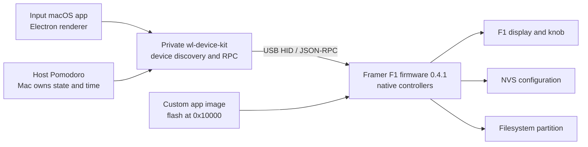
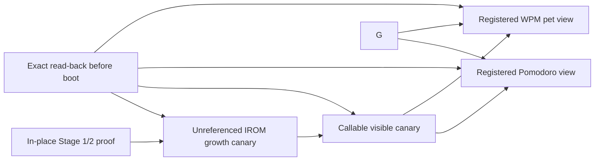

# System architecture

The confusing part of this project is that “widget” can refer to three
different layers. They share names and visuals, but they do not share an
installation mechanism.



## Layer 1: Input desktop application

**Offline verified.** Input 0.18.2 is an Electron application. Its renderer
decides which widget cards are visible and its main process loads the private
`@worklouder/wl-device-kit` package. Forcing Pomodoro and Media Player cards in
a separate `Input Lab.app` changes the catalog presentation only.

The lab build was deliberately separate from `/Applications/input.app`. The
signed installed application remained useful because its Node environment can
load the native SDK and expose a local Chromium debugger when launched with
`--inspect=9230`.

## Layer 2: device SDK and transport

**Offline and live verified.** The extracted SDK identifies the Framer as
device type `knob_f1`. It discovers the USB device, opens the communication
transport, and sends JSON-RPC-like calls. The research CLI guards that transport
so ordinary inspection is read-only.

The useful undocumented display method is:

```json
{"method":"v.framer.bubble","params":{"l":"FOCUS","v":"25:00","d":1,"s":1},"id":1}
```

This method changes RAM-backed UI state. It does not install a widget or modify
flash.

## Layer 3: Framer firmware

**Offline verified.** Stock Framer 0.4.1 is an ESP-IDF application with native
C++ UI/controller code. It contains the built-in Timer, the Framer bubble
renderer, and a linked but unwired Pomodoro-like state object. It does not
contain a visible/registered Pomodoro view, the Nomad Media Player controller,
MicroPython runtime, `wlsdk` application manager, or a matching dynamic app
registry.

This is why a card can be visible in Input while installation does nothing:
desktop catalog visibility does not create the missing Framer view, navigation
registration, or package runtime. Linked state-machine code by itself is not a
selectable widget.

## Layer 4: persistent storage

**Live verified by the complete flash capture.** The 16 MiB layout has a factory app
at `0x10000`, NVS at `0x810000`, and a filesystem partition at `0x830000`.
Persistent user/device settings can live outside the app image, so restoring
only the public merged firmware is not equivalent to restoring the device's
complete pre-experiment state.

The native experiment therefore writes an app image at `0x10000` and leaves NVS
and filesystem partitions alone. The full-device dump remains the recovery
backstop.

## Controlled native-image growth

Same-length, in-place patches are the right constraint for Stage 1 and the
current Stage-2 bridge because they minimize loader, mapping, and ownership
risk. They are not a permanent architecture rule. A separate selectable
Pomodoro or WPM pet will likely need new view/controller code, state, strings,
assets, and navigation records, so the user has accepted controlled growth of
the factory application image.

The immutable storage boundary is the factory partition, not the current
1,960,000-byte file. It starts at `0x10000`, has size `0x800000`, and ends just
before NVS at `0x810000`. Any grown app, including its sector-rounded flash
erase/write range, must remain below that end address. The partition table,
NVS, filesystem, and coredump remain outside the experiment.



Each product arrow is a separate hash-pinned build and live decision gate.
Before boot, the exact written length is read back, hashed, compared, and parsed
as an ESP application. Stage 3A passed exact growth/read-back/boot; Stage 3B
passed exact read-back, boot, and visual execution; Stage 3C has now passed an
exact app-only write/read-back and normal boot. Its live UI result is defective:
ID `7` opens a black screen and a faint `wpm` popup appears only briefly after
cycling away. Analysis found that ID `7` had a blank root while its code wrote
the global bubble consumed by ID `8`. Stage 3C.1 instead builds labels
under ID `7`'s own root. Independent audit gave STATIC GO, its exact
write/read-back/boot passed, and the user confirmed persistent white `wpm` text
plus typing-driven value updates. Stage 3C.1 therefore fixes the prior visual
ownership defect and is the Stage-3D rollback base. Stage 3D now has an offline
executable model and ABI STATIC GO plus exact live write/read-back and healthy
boot evidence. Runtime is partial/defective: text rendered, the cat did not
update, and one non-repeated crash/watchdog reboot followed the first restart.
The wrong current-controller lookup proves the no-update cause; coredump
decoding, crash attribution, and an image-frame implementation remain open. Physical
escape has not been demonstrated on the F1 PCB. That no
longer blocks an experiment already completed successfully, but remains a
material recovery risk for Stage 2 and future crash-prone images.

## Nomad SDK architecture is a reference, not a payload

**Offline verified.** The SDK alpha published by Work Louder is explicitly for
Nomad v1. Its documented package layout uses paths such as
`/fs/apps/<bundle>/app.py` plus a manifest and a MicroPython/LVGL runtime. Stock
Framer 0.4.1 does not expose that runtime.

The Nomad implementation can still teach us interaction design, state-machine
behavior, and likely naming conventions. Its merged image must not be flashed
to the F1: matching ESP32-S3 and partition dimensions do not imply matching
display, encoder, buzzer, or power-control drivers.
