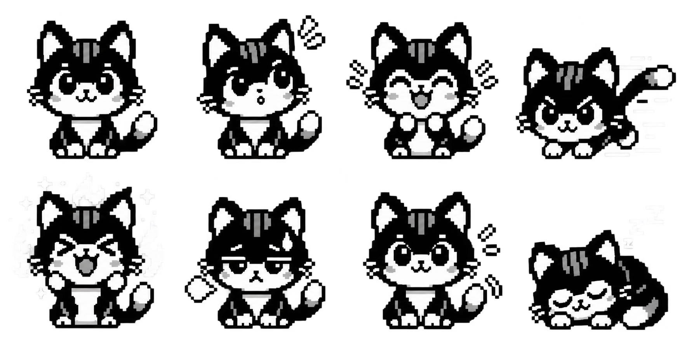

# Stage 3E runtime repair and native sprite design

Status: **Stage 3E LIVE VISUAL SUCCESS. Stage 3E.1 is deterministic/offline
built and not live. Stage 3E.2 has exact live image/boot evidence but is a
RUNTIME NO-GO. Stage 3E.3A has independent STATIC GO plus live write/full
read-back/boot success; visual I4-canary acceptance is pending.**

## Why the live cat stayed in the ready face

The no-update defect is now exact. Stage 3D's key wrapper reads
`0x3FCAB378 + 12` as though it were the current screen controller. That global
is the object returned by `0x42006888`, used by central setup as the navigation
manager. It is not the controller registry used by the screen lifecycle.

The verified current-controller path is:

1. `0x42004E1C` returns the root singleton at `0x3FCAB210`;
2. `0x4210AD9C(root)` returns `root + 80`, the screen registry;
3. `0x4210AF48(registry)` returns the pointer stored at `registry + 12`.

Stage 3D therefore never recognizes ID 7 and never increments controller
`activityEpoch` at `+36`. The UI sees `sessionActive == 0`, so state selection
continues to choose ready even while the separately rendered WPM number changes.

This proves why activity-driven cat updates failed. It is separate from the
captured crash: the decoded core identifies the `wl_lvgl` task and records
`StoreProhibited`, `EXCVADDR=0xEE`, inside ROM `strcpy` through
`lv_label_set_text`, with the return chain immediately after Stage 3D's
face-label update. Stage 3E removes both the invalid global key hook and the
face label, then reduces remaining label churn with last-rendered WPM, A/H/L,
and color caches.

## Live coredump capture

A read-only live capture saved the 65,536-byte coredump partition as
`/private/tmp/framer-stage3d-coredump.bin`, SHA-256
`3953cdfcc5e675515ae147551e5a8bd662ef9b8f007bf4fcdbf0264476295d80`.
That differs from the pre-custom coredump backup SHA-256
`71189f7fb6aed638640078fba3a35fda6c39c8962e74dcc75935aac948da9063`.
At byte offset `24`, the capture contains a valid 32-bit little-endian Tensilica
Xtensa ELF core. The keyboard remained healthy after the read-only capture.

The core pins the failing label-copy path, but it does not prove why the
destination object became invalid only once. Stage 3E therefore preserves the
stock lifecycle, guards every object pointer, skips unchanged label calls, and
re-centers labels after changed text without claiming a narrower heap cause.

## Generated style references and device-target constraints

The original generated style sheet is
[`wpm-cat-sprite-concept-v1.png`](../framer-widgets/assets/wpm-cat-sprite-concept-v1.png):
a 1774×887 RGBA, 4×2 concept grid for ready, curious, happy, zooming, fire,
tired, waiting, and sleeping. It is a **concept/style sheet only**, not a frame
bank used by firmware and not evidence of device rendering.



The selected direction is a blue cat. Generated working assets are:

- blue concepts
  [`v2`](../framer-widgets/assets/wpm-cat-sprite-concept-v2-blue.png) and
  [`v3 transparent`](../framer-widgets/assets/wpm-cat-sprite-concept-v3-blue-transparent.png);
- eight generated 68×56 RGBA source frames in
  [`wpm-cat-frames-v2-blue/`](../framer-widgets/assets/wpm-cat-frames-v2-blue/),
  ordered ready, curious, happy, zooming, fire, tired, waiting, sleeping;
- a generated blue-frame
  [preview](../framer-widgets/assets/wpm-cat-frames-v2-blue-preview.png);
- a generated dark-night-sky
  [concept](../framer-widgets/assets/night-sky-concept-v1.png) and two 100×100
  twinkle source frames in
  [`night-sky-frames-v1/`](../framer-widgets/assets/night-sky-frames-v1/); and
- composed generated
  [preview v1](../framer-widgets/assets/wpm-pet-night-preview-v1.png) and
  [centered preview v2](../framer-widgets/assets/wpm-pet-night-preview-v2-centered.png).

The PNGs remain generated source/concept assets. All ten selected frames have
now also been converted to pinned LVGL-v9 I8 inputs under
[`device-lvgl-v1/`](../framer-widgets/assets/device-lvgl-v1/). The native DROM
bank is 60,944 bytes (SHA-256 `db51e51c…f5fab4`), padded to exactly 65,536
bytes (SHA-256 `e805083c…64582f`) for MMU congruence. Those exact bytes are now
installed in the live app image, and the user confirmed the Stage-3E visual
result on the keyboard. The original concept sheets remain style references;
only the converted/pinned Stage-3E assets are part of that device evidence.

## Stock wallpaper and LVGL image pipeline

The official 0.4.1 app contains a normal LVGL 9 image object behind the
wallpaper abstraction. The relevant reviewed ABIs are:

| Address | ABI / evidence |
| --- | --- |
| `0x420AE8A0` | `lv_image_create(parent) -> image`; stock code calls it with the background root and stores the result at background `+124` |
| `0x420AEEF0` | `lv_image_set_src(image, source)`; stock set/reset paths call it with an image descriptor or null |
| `0x4204EEE4` | show/hide wrapper `(object, hidden_bool)` |
| `0x4204F0D0` | alignment wrapper `(object, align, x, y)`; it is generic and safe for an image object |
| `0x4204B788` | background setter; applies scale `0x100`, calls `lv_image_set_src`, then unhides the image |
| `0x4204BA82` | creates the one background image child, sizes/aligns it, and initially hides it |
| `0x42052DF0...` | custom wallpaper `image_loader.cpp`; recognizes LVGL color formats `0x07`, `0x08`, `0x09`, `0x0A` (I8), and `0x12` (RGB565), then loads/converts into a memory descriptor or streams RGB565 rows |

The background creates one image object and changes only its source. Cleanup
sets the source to null and hides it. The LVGL parent/root owns child deletion;
controller cleanup should clear borrowed object pointers, not free the child.

The firmware also includes LVGL's `lv_bin_decoder`, so a file source is a
real compiled capability. However, `LV_BIN_DECODER_RAM_LOAD` is disabled, and
the stock `/fs/wallpaper_bg.bin` path goes through Work Louder's custom
`image_loader.cpp`, not directly through `lv_image_set_src("/fs/...")`. A raw
`/fs` path as a direct image source is therefore not a reviewed ABI for ID 7.
The persistent first sprite should use immutable memory descriptors rather
than depend on an LVGL filesystem path or a file that may disappear.

## Input converter file layout versus a native descriptor

Input's converter emits an LVGL-v9 serialized I8 file:

```text
offset  size  meaning
0       1     header magic 0x19
1       1     color format 0x0A (I8)
2       2     flags, little-endian (0 for current output)
4       2     width
6       2     height
8       2     stride (one index byte per pixel)
10      2     reserved
12      1024  256-entry, four-byte palette
1036    ...   stride * height index bytes
```

This serialized file is not an in-memory `lv_image_dsc_t`. On this 32-bit
target the native descriptor is 24 bytes: the same 12-byte header, `data_size`
at `+12`, a data pointer at `+16`, and a null reserved pointer at `+20`.
Passing the converter file itself as a variable source would interpret its
first palette words as a size and pointer.

[`framer-lvgl-sprite.mjs`](../custom-firmware/lib/framer-lvgl-sprite.mjs)
converts serialized I8 frames into immutable 24-byte descriptors followed by
their palette/index bytes. It is an offline asset-bank builder only; it does
not alter an ESP image.

## Implemented ID7 sprite ownership and switching

Stage 3E starts from the exact live Stage 3C.1 lifecycle and does not retain
the defective key hook:

1. allocate a 208-byte controller with its vtable at non-overlapping `+160`;
2. in slot 1, create the 100×100 sky image first, the centered 68×56 cat image
   second, then the top WPM and bottom A/H/L labels;
3. switch the sky descriptor every second and sample the stock WPM float every
   500 ms on the LVGL thread;
4. switch the cat source only when its semantic frame changes and update a
   label only when its cached value changes; and
5. in slot 4, zero all four borrowed object pointers. The common root teardown
   owns deletion; static descriptors and pixels are never freed.

Each state gets a separate immutable descriptor. Reusing one mutable
descriptor and only changing its data pointer risks LVGL decoder/cache identity
rules. Recreating an image object per frame creates unnecessary ownership and
heap pressure. One object plus immutable source switching exactly follows the
stock background pattern.

The native WPM writer runs every 500 ms and computes approximately
`new = 0.9 * old + 12 * key_count`; its residual decays during idle. Stage 3E
uses rises in that proven value as its hook-free activity evidence, so the
state machine and its flat-EWMA limitation remain entirely UI-thread-owned.

## Image placement and mapping budget

Static descriptors and pixel data must be readable through the data bus. Put
them in DROM, not appended IROM. An IROM virtual address is instruction-mapped;
handing it to LVGL as descriptor/pixel data can fault.

The stock DROM segment is mapped at `0x3C120020` and ends at `0x3C1C1190`.
Growing that early segment shifts the later IROM's physical file offset. To
preserve ESP32-S3 64-KiB flash-MMU congruence, DROM growth must be padded to a
whole `0x10000` bytes. Eight 68×56 I8 cat frames require 38,848 bytes including
their native descriptors and palettes. Two 100×100 I8 night-sky frames require
22,096 bytes. Together they occupy exactly 60,944 bytes, leaving 4,592
zero-padded bytes in the one added `0x10000` DROM page. The complete bank and
all ten converter outputs are hash-pinned.

The builder appends no second DROM or IROM segment. It extends the existing
DROM by one mapping page and the existing IROM in place, shifts later segment
records/footer, repairs checksum/digest, and asserts both mapped physical
offsets remain congruent with virtual addresses modulo `0x10000`.

## Deterministic Stage-3E image

The guarded builder is
[`build-stage3e.mjs`](../custom-firmware/build-stage3e.mjs). It first rebuilds
and hashes the exact live Stage 3C.1 rollback base, then extends the existing
DROM by one 64-KiB page, extends the one existing IROM by 1,272 bytes, patches
only the setup pointer, and repairs the ESP checksum and digest.

| Artifact | Bytes | SHA-256 |
| --- | ---: | --- |
| Stage-3E S3 ABI | 1,272 | `e96498a5a7dde80dff9bd043554463a5b48b28ebc5d87091bc625afb52f405f3` |
| factory app | 2,027,312 | `546ece0044e4a69ae8db9d9a781edc776f3d1d20d82105afd9ee6de47ff01aba` |
| merged image | 2,092,848 | `aed65c609fa5317921b0c06c081876ef504788aa3868d43f6e5c8781301b6f1d` |

The final app has six segments, one DROM ending at `0x3C1D1190`, one IROM
ending at `0x42117408`, checksum `0x51`, and appended digest
`dee6f1b159886c1a878debd247c21907c2dd4499573a16f8aa4f9ce72e8a79f7`.
The stock key callback remains `0x4206EAE0`; the stock
Timer getter and native WPM tick remain unchanged. The current firmware suite,
including Stage 3E.1 through 3E.3A, passes 97/97; the ESP32-S3 ABIs verify little-endian with
zero final relocations, all assembly/ABI verifiers pass, and an independent
Stage-3E reconstruction is byte-identical.

```sh
node custom-firmware/tools/verify-stage3e-abi.mjs
node --test custom-firmware/test/*.test.mjs
node custom-firmware/build-stage3e.mjs
```

The eight cat descriptor indices are semantic: ready, curious, happy, zooming,
fire, tired, waiting, and sleeping. Stage 3E uses a rising WPM value as its
hook-free activity signal; ten non-rising 500-ms samples wait and sixty sleep.
After twenty samples, zooming means current is at least 90% of the session
high, a below-average current is tired, and a new high shows fire for three
samples. WPM text color still uses absolute zero/<40/<80/>=80 bands.

## Live deployment record

The exact candidate above was deployed only to the factory-app partition.
Preflight reported `knob_f1`, DevSrvsID `4295022895`, firmware `0.4.1`, profile
`0`, layer `1`, battery `100%`, not charging. ROM identified the same ESP32-S3
unit at MAC `a4:cb:8f:af:32:10`; Secure Boot and Flash Encryption remained
disabled.

The 2,027,312-byte app was written at `0x10000`. The sector-rounded erase ended
at `0x1FEFFF`, esptool's write hash verified, and the device intentionally
remained in the bootloader. An initial full read-back process stopped making
progress and was terminated; it produced no file and therefore supplied no
evidence. The clean retry completed in 178.7 seconds as
`/private/tmp/framer-stage3e-wpm-sprite-readback2.bin`. Its size and SHA-256
exactly matched the build, and `cmp` found zero differing bytes. `image-info`
again reported six segments with one DROM and one IROM; checksum `0x51` and the
appended digest above both validated.

After watchdog reset, postflight returned healthy `knob_f1` as DevSrvsID
`4295024385`, firmware `0.4.1`, profile `0`, layer `1`, battery `100%`, not
charging. No bootloader, partition-table, NVS, filesystem, or coredump range was
written. This is live image and health acceptance. The user subsequently
confirmed the rendered Stage-3E screen, promoting the sprite pipeline to LIVE
VISUAL SUCCESS.

## Stage-3E live visual result and logical canvas

The user confirmed Stage 3E renders on the device. This proves the screen-owned
LVGL image objects, immutable descriptor bank, cat frame path, and WPM layout.
It does not by itself stand in for a long-duration reset/coredump soak.

The live result also proved the display coordinate system. Although the product
is marketed as a 310×100 display, LVGL exposes the rotated logical canvas as
**100×310**. A centered 100×100 sky therefore spans the full logical width but
only vertical coordinates `105..204`: the middle 100 pixels, roughly the middle
third of the 310-pixel height. That middle-third result is expected geometry,
not a failed image decoder. The exact Stage 3C.1 app remains the rollback image.

## Stage 3E.1 — deterministic full-canvas milestone

Status: **OFFLINE BUILT / deterministic; NOT LIVE**. Stage 3E.1 expands both
sky frames to the proven 100×310 logical canvas while keeping the centered
68×56 blue cat, top-middle WPM label, and bottom-middle two-line `Avg`/`Top`
analytics. It retains the stock key callback and uses no global key hook.

| Artifact | Exact offline value |
| --- | --- |
| Full-canvas asset source/manifest | [`night-sky-frames-v2-full/`](../framer-widgets/assets/night-sky-frames-v2-full/) and [`device-lvgl-v2-full/manifest.json`](../framer-widgets/assets/device-lvgl-v2-full/manifest.json) |
| Native asset bank | 102,944 bytes; SHA-256 `e627332b347aebb736d6605aa5c7a176077ad5016b615cf148608d62cebba890` |
| Padded DROM bank | 131,072 bytes; SHA-256 `e8b37c53dfeb68ca9e2035c391fb2909791970dcbab9eec67eb0b00941da4efe` |
| S3 ABI | 1,280 bytes at `0x42116F10`; SHA-256 `6842f6246ed40c0e5ddbcdc105b64e74126e7b86735c312d8c6c487b6418b05e` |
| App | 2,092,848 bytes; SHA-256 `cf645558f576df17e66db14ec8636a507004f1679515dc935965cf2d55ca9b04` |
| Merged | 2,158,384 bytes; SHA-256 `787fdf452cb5b782fac13f198a820ac6aa021d82a4b61cb8e34c8bdd3dbea7b7` |
| Integrity | Checksum `0x66`; digest `98af4d78e8f77cd6508b6dd87c6238d45cdfe15445f7a67e81eb4b001d0e7995` |
| Layout | Six segments; DROM end `0x3C1E1190`; IROM end `0x42117410` |

Implementation/evidence:
[`build-stage3e1.mjs`](../custom-firmware/build-stage3e1.mjs),
[`stage3e1-wpm-full-canvas.S`](../custom-firmware/experimental/stage3e1-wpm-full-canvas.S),
[`stage3e1-wpm-full-canvas.ld`](../custom-firmware/experimental/stage3e1-wpm-full-canvas.ld),
[`stage3e1-wpm-full-canvas.hex`](../custom-firmware/experimental/stage3e1-wpm-full-canvas.hex),
[`verify-stage3e1-abi.mjs`](../custom-firmware/tools/verify-stage3e1-abi.mjs),
[`stage3e1-full-canvas.mjs`](../custom-firmware/lib/stage3e1-full-canvas.mjs),
[`stage3e1-full-canvas.test.mjs`](../custom-firmware/test/stage3e1-full-canvas.test.mjs),
[`stage3e1.test.mjs`](../custom-firmware/test/stage3e1.test.mjs), and
[`stage3e1-manifest.json`](../custom-firmware/build/stage3e1-manifest.json).

These hashes describe an offline artifact. They are not a flash, read-back,
boot, or visual result.

## Stage 3E.2 — six selectable species

Status: **STATIC/INDEPENDENT GO + LIVE WRITE/FULL READ-BACK/BOOT/HEALTH
SUCCESS; RUNTIME NO-GO**. The fixed roster and dial order
are:

1. Belgian Tervuren
2. Pepe
3. Angry owl
4. Cute ferret
5. Cat
6. Lazy cow

The generated source bank contains 48 normalized 68×56 RGBA frames: six
species × the eight states ready, curious, happy, zooming, fire, tired, waiting,
and sleeping. The pinned roster/frame evidence is
[`wpm-pet-species-frames-v1/manifest.json`](../framer-widgets/assets/wpm-pet-species-frames-v1/manifest.json),
with a generated
[six-by-eight preview](../framer-widgets/assets/wpm-pet-species-frames-v1/preview-6-species-x-8-states.png).

Control is ID-`7`-local vtable slot `9`: hold Fn and turn the bottom
knob clockwise for the next species or counterclockwise for the previous
species. Selection is RAM-only, defaults to Cat (index 4), persists while
leaving/re-entering ID 7, and resets on reboot. The handler sign-extends the
dispatcher's low delta byte, accepts only bottom encoder ID 1 with Fn held,
updates controller `+120`, and returns without calling LVGL. The dispatcher's
immediate slot-6 call observes `+120 != +124` and switches the descriptor using
`(species * 8 + state) * 24`. The design does not add a global key hook.

| Artifact | Exact offline value |
| --- | --- |
| Normalized source frames | 48 × 68×56 RGBA; manifest SHA-256 `b9f3c6d27144c5ce3c46817e2c137e9402f38bdba5c5c706b973fa47afc0dd69` |
| Converter manifest | 50 descriptors (two skies then six × eight pets); SHA-256 `5688fcebf05cace46cea79b5bc8684cc352426f9b23777e5e75a3c905f923524` |
| Native asset bank | 297,184 bytes; SHA-256 `e06ba6d81e6f3dab82798cbf3edcfd1307740eedbd27a7bb48adbe3958e86a13` |
| Padded DROM bank | 327,680 bytes (`0x50000`); SHA-256 `21e30977cea669ebe74ddc85a7ecbefc4954070f320d7dc5db25ab34292e9dfd` |
| S3 ABI | 1,440 bytes at `0x42116F10`; SHA-256 `705866dae8a2968a69bbbda33e38c9bfec3760019149c6b266909e67d0a3b66f` |
| App | 2,289,616 bytes; SHA-256 `3e6b2b234ade0a3d27d14198ceeedd2a5367dfb81281db8f187aec5f8aa695c5` |
| Merged | 2,355,152 bytes; SHA-256 `699b85f33f53f2ad24820baf3982698b892a91d494f08f2b22dc117eb1f81951` |
| Integrity | Checksum `0xD7`; digest `84411d9cedd4bf8aff9267a583f6b733bbf57423555ceadf02afaf65e6ca6659` |
| Layout | Six segments; one DROM ending `0x3C211190`; one IROM ending `0x421174B0` |

The deterministic builder starts from exact live Stage 3C.1, changes only the
setup pointer in the original prefix, appends five DROM mapping pages and the
pinned ABI to the existing IROM, and keeps the stock global key callback,
Timer getter, and native WPM tick unchanged. The aggregate firmware suite is
97/97; the focused Stage 3E.2 state/image tests are 13/13; widget asset tests
are 14/14. The ABI is ESP32-S3 little-endian with zero final relocations, and
an independent reconstruction matched every output hash.

Implementation/evidence:
[`extract-wpm-species-frames.mjs`](../framer-widgets/tools/extract-wpm-species-frames.mjs),
[`build-device-image-assets-v3-species.mjs`](../framer-widgets/tools/build-device-image-assets-v3-species.mjs),
[`build-stage3e2.mjs`](../custom-firmware/build-stage3e2.mjs),
[`stage3e2-wpm-species.S`](../custom-firmware/experimental/stage3e2-wpm-species.S),
[`verify-stage3e2-abi.mjs`](../custom-firmware/tools/verify-stage3e2-abi.mjs),
[`stage3e2-species-control.test.mjs`](../custom-firmware/test/stage3e2-species-control.test.mjs),
and [`stage3e2.test.mjs`](../custom-firmware/test/stage3e2.test.mjs).

### Stage-3E.2 live deployment record

Only the factory app was written: 2,289,616 bytes at `0x10000`, with the
sector-rounded erase ending at `0x23EFFF`. Esptool's write hash verified. The
full read-back was saved as `/private/tmp/framer-stage3e2-readback.bin`; its
size was exactly 2,289,616 bytes and SHA-256 was
`3e6b2b234ade0a3d27d14198ceeedd2a5367dfb81281db8f187aec5f8aa695c5`.
`cmp` found zero differences. Checksum `0xD7` and digest
`84411d9cedd4bf8aff9267a583f6b733bbf57423555ceadf02afaf65e6ca6659`
validated.

After watchdog reset, healthy `knob_f1` re-enumerated as DevSrvsID
`4295032152`, firmware `0.4.1`, profile `0`, layer `1`, battery `100%`, not
charging. This is live image and health evidence, not visual/control acceptance.

Runtime observation failed visual acceptance:

- logic/control appears alive;
- pet/avatar images render as white squares; and
- during twinkle/background switching, roughly the lower 90–100% of the
  display glitches black or takes over the background.

Do not claim full 100×310 background success, correct species rendering, or
accepted roster control. The failure boundary is now exact. Stock DROM ends at
`0x3C1C1190`, and the final originally mapped 64-KiB page ends at
`0x3C1D0000`. Stage 3E.2 sky-1 pixel data begins at `0x3C1C9758` and crosses
that page after 26,792 pixels, row `267`, column `92` of its 100×310 image.
That predicts the observed bottom 42 rows, about 13.6%, turning black. Every
pet payload begins at or above `0x3C1D1070`, which predicts the white avatar
squares. The emitted descriptors, palettes, build, and read-back remain exact;
the additional DROM virtual pages are not runtime-readable on this firmware.
Stage 3E.2 is therefore a **RUNTIME NO-GO**, not a candidate to retry.

For this image-decoder track, the prior live visual rollback is the Stage-3E
app, SHA-256
`546ece0044e4a69ae8db9d9a781edc776f3d1d20d82105afd9ee6de47ff01aba`.
The smaller Stage-3C.1 app remains the independently accepted owned-label
baseline and recovery fallback, SHA-256
`e2e7ba4ab4b9c247af8c0bdc3d7896ac52967bb7f90fb19beae73c0ae4a2b8fd`.

## Stage 3E.3A — isolated in-page I4 decoder canary

Status: **INDEPENDENT STATIC GO + LIVE WRITE/FULL READ-BACK/BOOT/HEALTH
SUCCESS; VISUAL ACCEPTANCE PENDING**. Stage 3E.3A deliberately removes the
Stage-3E.2 switching, full-canvas skies, species control, and global hooks. It
starts from exact live Stage 3C.1, paints an opaque dark root, creates one
screen-owned image, assigns one immutable 52×42 binary-alpha I4 cat source,
and centers it at x/y `0`. The exact Stage-3C.1 `wpm` labels remain.

The independent audit reconstructed the final image from the exact Stage-3C.1
app without using the Stage-3E.3A builder and matched every emitted byte. The
only semantic changes are the setup pointer, one 64-KiB DROM append whose first
1,180 bytes are the canary bank and whose remainder is zero, and a 580-byte
IROM append. Segments 1, 2, 4, and 5 are byte-identical to Stage 3C.1. Stock
key, Timer-getter, and native WPM-tick pointers remain unchanged.

| Artifact/property | Exact value |
| --- | --- |
| Serialized I4 | 1,168 bytes; 52×42, stride 26, format `0x09`, binary alpha; SHA-256 `0ad586b3a5002fee3cb16498045ead72cae8c8e7befc18133d750f815034fc03` |
| Native descriptor/bank | 24-byte descriptor plus palette/pixels; 1,180 bytes; `0x3C1C1190..0x3C1C162C`; SHA-256 `f651cf38ee0dc567b2240d61b263ecd4e525f68b34549780a897b370c111aff1` |
| Runtime boundary | Bank ends 59,860 bytes before `0x3C1D0000`; no canary pointer targets the zero padding above it |
| S3 ABI | 580 bytes at `0x42116F10`; little-endian, zero relocations; SHA-256 `13cc66c1d97616af9c3efa535133fb3b40e1a509eabe6bb5b62342c6f19f3f6d` |
| App | 2,026,624 bytes; SHA-256 `dd8edaaa2c3aa98a1cbdbda319255cc7d1a0e02d0069f543dd574ef040db4b83` |
| Merged comparison image | 2,092,160 bytes; SHA-256 `2349e1317320e8d2e7d4a6291fb2211d62af1f78fb03c3bf7369f05d4d659797` |
| Integrity/layout | Six segments, one DROM and one IROM; checksum `0x40`; digest `1f940f7663310bfae78174ab276a54b74c10617ddb68675acdad908772f1f62d` |
| Tests | Five focused tests and the current 97/97 firmware suite pass |

Implementation/evidence:
[`build-stage3e3a.mjs`](../custom-firmware/build-stage3e3a.mjs),
[`stage3e3a-i4-canary.S`](../custom-firmware/experimental/stage3e3a-i4-canary.S),
[`stage3e3a-i4-canary.ld`](../custom-firmware/experimental/stage3e3a-i4-canary.ld),
[`stage3e3a-i4-canary.hex`](../custom-firmware/experimental/stage3e3a-i4-canary.hex),
[`verify-stage3e3a-abi.mjs`](../custom-firmware/tools/verify-stage3e3a-abi.mjs),
[`stage3e3a.test.mjs`](../custom-firmware/test/stage3e3a.test.mjs), and the
[`I4 asset manifest`](../framer-widgets/assets/device-lvgl-v4-i4-canary/manifest.json).

### Stage-3E.3A live deployment record

Only the 2,026,624-byte factory app was written at `0x10000`; the
sector-rounded erase range was `0x10000..0x1FEFFF`, and esptool's write hash
verified. The complete read-back was saved as
`/private/tmp/framer-stage3e3a-readback.bin`. It was exactly 2,026,624 bytes,
matched SHA-256
`dd8edaaa2c3aa98a1cbdbda319255cc7d1a0e02d0069f543dd574ef040db4b83`,
and `cmp` reported zero differences. Checksum `0x40` and digest
`1f940f7663310bfae78174ab276a54b74c10617ddb68675acdad908772f1f62d`
validated.

After watchdog reset, healthy `knob_f1` re-enumerated as DevSrvsID
`4295034213`, firmware `0.4.1`, profile `0`, layer `1`, battery `100%`, not
charging. This proves the audited bytes, app-only write, exact read-back, and
normal boot/USB health. It does **not** yet prove the visual decoder result.
Acceptance requires the user to observe an opaque dark background with one
centered, transparently outlined I4 cat and confirm both prior failure modes
are absent: no white image square and no lower-screen black/glitch takeover.

The separate Music Player ID-`1` module is ready only as a deterministic
offline ABI candidate. It has not been combined with Stage 3E.3A, linked into
an app image, flashed, or observed on hardware.
