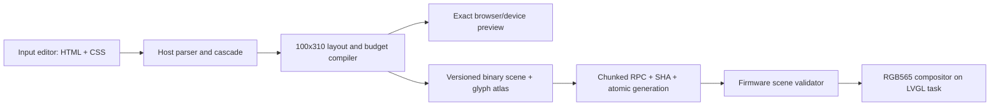

# CSS-authored widget renderer

## Decision

Use HTML and a constrained CSS dialect as the **host authoring language**. Do
not send raw HTML/CSS to the Framer F1 and do not implement a browser, DOM,
selector engine, cascade, or CSS parser in firmware.

The Input-side tool should parse and preview source, resolve selectors and
layout, lower keyframes into bounded records, rasterize required glyphs, enforce
budgets, and send an atomic binary scene. A stable renderer widget on the
keyboard should validate that scene and execute it on the existing 100 ms LVGL
UI tick. After that one renderer is installed, ordinary widget edits should be
scene updates rather than firmware flashes.

This is not one-to-one CSS emulation. It is a compiler with an explicit,
inspectable lowering report.

## What is proven

| Contract | Evidence available in this workspace |
|---|---|
| Logical display | LVGL exposes a 100×310 canvas; the marketed orientation is 310×100. |
| UI cadence | Screen controllers receive a 100 ms LVGL-thread refresh callback. |
| Screen lifecycle | Root construction, screen-loaded activation, screen-unloaded cleanup, timer teardown, and root-owned child deletion are live exercised. |
| Software canvas | Music ID1 uses a controller-owned 100×310 RGB565 buffer: exactly 62,000 bytes. |
| Stable object shape | One screen-owned image plus a small number of ordinary labels is live accepted. |
| Host/device transport | Versioned RPC registration, bounded metadata, chunking, generation handoff, and host-side polling are live exercised. |
| Atomic dynamic data | Artwork uses inactive/active buffers and a UI-thread generation apply; the RPC task does not call LVGL. |
| Indexed art | I4 source parsing and small, in-page assets are proven. Controller-owned RAM image data is used by WPM. |
| Input controls | Screen-local controller slots and Fn-plus-bottom-encoder behavior are proven by WPM. |
| Firmware build safety | Existing tooling pins exact firmware, one setup wrapper, Xtensa little-endian output, zero relocations, image layout, checksum, digest, rollback, and app-only deployment. |

These facts are enough for a small retained scene runner and a software
compositor. They are not evidence that a browser runtime will fit or behave
safely.

## What is not proven

- Stock firmware font coverage for Katakana. The renderer therefore uses a
  generated atlas and does not assume an LVGL Japanese font. The host builder is
  pinned to Hiragino font SHA-256
  `97e5861e11656538bed9397730d7f46e2f1b0f07692f18e87c079f7ce9ff6bdc`
  and ImageMagick 7.1.2-21; a different input fails closed.
- Actual free internal/PSRAM heap after WPM, Music, LVGL, USB, and Input tasks
  have reached steady state. The current matrix estimate is plausible but still
  needs allocation telemetry and a device soak.
- A generic `widget.scene.*` RPC namespace, scene validator, and atomic scene
  swap. Music proves the transport pattern, not this new protocol.
- Input's supported settings-extension surface for a code editor. The separate
  localhost Input Lab editor, exact preview, three-slot save, capture, and mock
  Apply flow are implemented; embedding that surface in official Input still
  needs an API audit.
- Persisting arbitrary scenes across reboot. The first renderer should be
  RAM-only and be republished by Input. Filesystem/NVS persistence needs an
  atomic format, versioning, rollback, and flash-wear policy.
- Real device frame time for animated glyph halos. The compiler can bound work,
  but only on-device timing can establish the safe number of dirty pixels per
  100 ms tick.
- Semantic-scene browser matching for font metrics, Gaussian blur, subpixel
  positioning, and CSS cubic Bézier curves. The F1RA escape hatch captures
  browser pixels instead, with explicit RGB565 and cadence quantization.

Unknown means fail closed or expose a preview warning; it must never silently
become an expensive firmware operation.

## Renderer-v1 CSS surface

The first version should be deliberately small.

| Authoring feature | Device lowering |
|---|---|
| Root width/height `100%` | Exact logical 100×310 viewport. |
| `background-color` | One RGB565 clear/fill color. |
| Fixed grid | Compile-time cell coordinates; no on-device grid algorithm. |
| Direct text children | Glyph IDs into a pinned 1-bit bitmap atlas. |
| `color` / alpha | Host-parsed RGBA, device-interpolated and composited to RGB565. |
| `nth-child(an+b)` | Host-resolved cell membership bitsets/animation IDs. |
| `@keyframes` | Shared bounded stop table with per-group duration and delay. |
| `linear` / `ease-in-out` | Linear or deterministic smoothstep interpolation. |
| `text-shadow` | Bounded 0–3 px halo/dilation; no Gaussian blur stack. |
| `overflow:hidden` | Compiler materializes visible cells only. |
| CSS variables | Host-resolved constants initially; typed runtime bindings later. |

Renderer-v1 should reject or explicitly lower:

- arbitrary selectors, inheritance, specificity beyond the accepted subset;
- DOM mutation, scripting, pseudo-elements, web fonts, network resources;
- flex/grid reflow after compilation;
- blur, filters, blend modes, masks, arbitrary box shadows;
- unbounded transitions, spring physics, and layout-affecting animations;
- percentages whose containing-block semantics are ambiguous;
- more than the declared cells, tracks, stops, objects, pixels, or memory.

Future versions can add bounded `translate`, `scale`, opacity, rectangles,
progress primitives, images, and typed data bindings. Each addition needs an
explicit runtime cost and a deterministic fallback.

## Keyframe execution

CSS keyframes should remain active on the device so animations continue when
the host is busy or disconnected. The host performs all expensive semantic
work:

1. Parse CSS and resolve cascade/order.
2. Deduplicate identical keyframe tracks.
3. Convert durations and delays into 100 ms ticks.
4. Quantize colors and glow radii.
5. Assign each visible node a compact animation-configuration ID.
6. Emit bounded keyframe records and a lowering report.

At runtime the keyboard advances a monotonic scene clock. For each animated
dirty cell it finds the surrounding stops, applies linear or smoothstep
interpolation, redraws only that cell, then invalidates/presents the shared
image. It never reparses source or searches selectors.

For the supplied matrix, every duration and delay is already a multiple of
100 ms, so tick quantization introduces no timing error. Browser
`ease-in-out` is currently lowered to smoothstep rather than the browser's
precise cubic Bézier; that difference is visible in the report and can later be
replaced by a small lookup table.

## Matrix example result

The hardware-free example is in
[`examples/jp-matrix`](../examples/jp-matrix/README.md). It adapts the supplied
desktop design to the device rather than pretending 1920×1080 maps directly to
100×310.

| Item | Compiled result |
|---|---:|
| Visible layout | 5 columns × 15 rows |
| Visible cells | 75 |
| Unique Katakana glyphs | 71 |
| Resolved animation schedules | 12 |
| Shared keyframe tracks | 1 |
| Animated cells | 35 |
| Binary scene | 1,048 bytes |
| 14×14 1-bit glyph-atlas estimate | 1,988 bytes |
| RGB565 framebuffer | 62,000 bytes |
| Descriptor storage | 48 bytes |
| Persistent total estimate | 65,084 bytes |
| Worst bounded dirty area/tick | 14,000 pixels before halo overhead |

The original `min-width:1920px`, `min-height:1080px`, 40 px rows, and 32 px
font cannot be preserved: proportional fit would make the cells unreadable and
the source aspect ratio differs radically from the device. The device profile
therefore chooses 20×20 cells and a 14 px bitmap glyph. That adaptation is the
important non-one-to-one part of the design.

The compiled scene, concrete glyph atlas, and reference RGB565 frame SHA-256s
are pinned by tests. The browser's Japanese font remains a design preview only;
the exact preview uses the same F1GA mask and software compositor contract as
the device runtime.

## SDK binary contracts now implemented

| Magic | Purpose | Important bounds |
|---|---|---|
| `F1SC` v1 | Semantic grid scene and local keyframes | 75 cells, 16 animation configurations, 8 stops/track, 100 ms tick |
| `F1GA` v1 | Row-aligned 1-bit glyph masks in scene glyph-ID order | 1–255 glyphs, dimensions no larger than 32×32 |
| `F1SB` v1 | Legacy three-slot semantic scene+atlas bundle | Three contiguous named slots, full SHA-256 per scene and atlas |
| `F1RA` v1 | Browser-rasterized RGB565 animation | Exact 100×310, at most 60 frames, at most 10 fps, 100 ms cadence, 128 KiB encoded |
| `F1WB` v1 | Three heterogeneous saved widgets | Each slot is semantic (`F1SC`+`F1GA`) or raster (`F1RA`), full SHA-256 per payload |

`F1RA` always begins with a complete 62,000-byte RGB565 keyframe. Each later
frame deterministically chooses the smallest of sparse-pixel, linear-span,
changed-tile, or complete-frame encoding. The decoder validates every ordered
offset/range, scheduled keyframe, reserved byte, declared length, cadence, and
the payload SHA before exposing frames. `fitRasterAnimation` tests real encoded
sizes and selects the largest evenly distributed frame set that fits, retaining
the full loop rather than dropping its tail.

This provides the escape hatch for arbitrary HTML/CSS: Input renders it inside
a sandboxed browser at exactly 100×310 and captures RGBA frames; the SDK
composites alpha, quantizes RGB565, and emits F1RA. SVG filters, radial
gradients, complex selectors, and hover can therefore look like the browser,
but they cost captured animation bytes and are not editable semantic objects on
the keyboard. Raw source still never crosses into firmware.

The hardware-free [`Less but better`](../examples/less-but-better/README.md)
example is the reference for this path. It preserves an animated radial
gradient, inline SVG turbulence, `mix-blend-mode`, transform, and a captured
hover state, then emits decoded RGB565 PNGs beside its F1RA binary. Those PNGs
are the exact payload preview; the editable browser view before RGB565
quantization is only the authoring view.

Semantic CSS now returns structured diagnostics. Equal-specificity accepted
rules cascade in source order; unsupported selectors/properties fail with
`CssCompileError`; intentional device-profile lowerings and ignored browser-only
declarations are warnings. The scene decoder and tick sampler are parity-tested
for all 75 cells over 100 ticks.

F1GA carries a `testOnly` bit. `createDeterministicTestGlyphAtlas` is a pipeline
fixture whose codepoint patterns are intentionally not letters; F1SB/F1WB
release encoding rejects that bit even when the caller supplies raw atlas bytes.
Only an explicit `allowTestAtlas` lab/test operation may bundle it. Production
compile, exact preview, and push must all reuse the same cached output of
`rasterizeGlyphAtlasWithMagick`.

## Exactness and supported-source boundary

There are two compiler backends because “supports CSS” has two materially
different meanings.

| Feature | Semantic F1SC | Browser-raster F1RA |
|---|---|---|
| Root background, fixed 5×15 text grid | Compiled structure | Captured pixels |
| Direct text spans and pinned Katakana | Exact F1GA glyph masks | Whatever the sandboxed browser paints |
| `nth-child(an+b)` | Resolved at compile time | Browser resolves it |
| Color/text-shadow keyframes | Local device animation | Captured frames |
| Linear / `ease-in-out` | Linear / deterministic smoothstep | Browser timing sampled at 100 ms multiples |
| Radial gradients, transforms, border radius | Unsupported | Captured exactly after RGB565 quantization |
| SVG filters, blend modes, pseudo-elements | Unsupported | Captured when they use only inline/local resources |
| Flex/grid/browser font metrics | Not retained | Captured; output may vary if host fonts/tool versions are not pinned |
| Hover | Unsupported | One explicit captured `hover` state |
| JavaScript, DOM mutation, network requests | Forbidden | Forbidden |

“Exact” for F1RA means the decoded RGB565 frames match the bytes sent to the
runtime. It does not mean the 16-bit display can reproduce the browser's
24-bit/subpixel output without quantization. F1SC exactness means Input and the
reference runtime use the same atlas, Q16 keyframe sampler, halo rule, and
RGB565 compositor.

The raster sandbox accepts inline HTML/SVG, inline CSS, `data:` assets, and
local SVG fragment URLs. It rejects scripts, event-handler attributes,
`javascript:`, `@import`, external URLs, iframes, objects, embeds, base-URL
changes, and navigation. Remote fonts/images must be converted to bounded data
assets before capture. No raw source or executable content enters firmware.

## Viewport, overflow, and clipping

The authoring viewport is always the logical **100 px wide × 310 px tall**
canvas. It is not a scaled 1920×1080 page. The physical keyboard presents that
same buffer rotated as 310×100; authors should use the tall logical preview for
coordinates and the rotated preview only to judge how it sits on the desk.

For semantic scenes, the compiler lowers the source into fixed device cells and
materializes only the first 75 visible items. Desktop minimum dimensions,
auto-fill behavior, and overflow content become diagnostics. For raster scenes,
Chromium lays out a real 100×310 page and the root clips everything beyond those
edges. A 128 px orb with `left:-14px`, for example, is deliberately clipped;
the compiler must not shrink it to fit.

Recommended edit loop:

1. Edit one saved slot's HTML/CSS and choose semantic or browser-raster mode.
2. Inspect the 100×310 authoring preview for clipping and safe areas.
3. Compile and read diagnostics plus memory/dirty-pixel or frame-delta budgets.
4. Inspect the decoded exact preview, including animation ticks and hover state.
5. Save the slot; repeat for the other two slots as needed.
6. Push one complete F1WB generation. On any validation failure, retain the
   last accepted generation rather than partially replacing a slot.

## Raster memory fitting and frame count

One full 100×310 RGB565 frame is 62,000 bytes. F1RA adds a 64-byte header and an
8-byte record per frame, so the mandatory first keyframe consumes 62,072 bytes
before later deltas. The default hard cap is 128 KiB. Later frames independently
choose the smallest valid full, sparse-pixel, linear-span, or changed-tile
record.

`fitRasterAnimation` does not estimate from raw frame count alone. It encodes
candidate sets from largest to smallest and returns the largest set whose real
bytes fit. When frames must be removed it chooses evenly distributed source
indices spanning the complete loop. It also keeps only counts whose
`loopDuration / frameCount` is an exact 100 ms multiple, because the device
cannot schedule an impossible browser frame rate.

Examples under the 128 KiB cap:

- a static widget fits one 62,000-byte keyframe;
- identical later frames cost only their 8-byte empty delta record;
- a moving small highlight usually uses pixels or spans and can retain more
  frames;
- a full-screen color/noise change may require another 62,000-byte full frame,
  leaving room for at most roughly two dense frames;
- if even one complete frame plus headers exceeds the configured cap, fitting
  fails rather than lowering resolution or corrupting the scene.

Input Lab should show requested frames, retained frames, selected source
indices, raw bytes, encoded bytes, chosen mode per frame, changed pixels, and
headroom. Reducing loop duration, fps, animated area, noise, or color churn can
all improve retention; calculations remain host-side.

## Three saved slots and F1WB

F1WB is a fixed-capacity, three-slot heterogeneous container. Each contiguous
named slot declares exactly one kind:

- `semantic`: one F1SC scene plus its matching production F1GA atlas;
- `raster`: one F1RA animation and no auxiliary atlas.

The header carries slot count, active-slot index, and generation. Every primary
and auxiliary payload has a full SHA-256 descriptor, bounded range, exact magic,
and non-overlapping offsets. Names are at most 16 UTF-8 bytes. The decoder also
rejects nonzero reserved bytes and production bundles containing an F1GA
`testOnly` marker.

The host validates all three slots before upload. The bounded device transport
then freezes the last displayed frame, streams the complete bundle into one
scene store, validates it, publishes its header/generation last, and resumes on
an atomic UI tick. The Fn-plus-bottom-knob handler then changes only the local
active index and wraps through the three resident slots; it does not contact
the host or recompile. Slots may mix modes—for example, semantic Katakana,
raster Less-but-better, and a second semantic palette—without changing the
control contract.

## Live scene transport contract

The reusable host protocol is `framer-widget-scene-rpc-v1`. It allowlists only
these six methods:

- `widget.scene.capabilities`
- `widget.scene.begin`
- `widget.scene.write`
- `widget.scene.commit`
- `widget.scene.abort`
- `widget.scene.status`

`begin` pins an expected generation, next generation, total bytes, chunk count,
3,072-byte chunk bound, transaction ID, and complete SHA-256. `write` accepts
only the next exact index/offset and verifies canonical base64, decoded length,
and per-chunk SHA-256. `commit` repeats the immutable manifest and succeeds only
after all bytes, the whole SHA, F1WB descriptors, payload hashes, F1SC/F1GA or
F1RA records, and runtime admission validate. `status` lets the host observe the
UI-thread generation handoff; an indeterminate queued commit is never blindly
aborted.

There are **not** two 96 KiB scene buffers. Renderer ownership is bounded to:

| Allocation | Maximum |
|---|---:|
| One in-place F1WB scene store | 98,304 bytes (96 KiB) |
| One 100×310 RGB565 framebuffer | 62,000 bytes |
| Header scratch | 20 bytes |
| Scene store + framebuffer | 160,304 bytes |

At `begin`, ID26 freezes on the last framebuffer and invalidates the in-place
F1WB publication marker. The first 20 header bytes remain in the tiny scratch
while later bytes stream directly into the one store. After validation, the
header and generation are installed last and the UI task resumes. A torn,
reordered, corrupt, timed-out, or explicitly aborted upload keeps the last frame
visible (or fail-black if no valid frame exists), leaves the scene store invalid,
and does not advance the accepted producer generation. It intentionally does
not claim that the overwritten previous scene is recoverable; Input must retry
the same next generation.

This visually atomic, single-store recovery policy avoids a 96 KiB duplicate,
but 160,304 renderer bytes are still not proven safe beside Music, WPM, LVGL,
USB, and Input. Capabilities therefore include `heapTelemetryAccepted`; the host
requires it to be exactly `true` in addition to an immutable live proof ID.

## Input authoring workflow

An Input-integrated editor is the right product experience, with one crucial
change to the proposal: **Apply should update the scene, not force a new
firmware app.**

Recommended settings surface:

- HTML fragment editor;
- constrained CSS editor;
- exact 100×310 preview plus rotated physical preview;
- compiler warnings and unsupported-property errors;
- live budgets for persistent bytes, cells, objects, dirty pixels, and tracks;
- Apply, Revert, and Restore last accepted scene;
- optional named data bindings and controller-input mappings.

Apply pipeline:

1. Compile locally and refuse any unsupported or over-budget source.
2. Negotiate the exact renderer version and limits with the keyboard.
3. Freeze the last displayed frame and stream the F1WB into the one bounded
   scene store, withholding its 20-byte publication header.
4. Validate length, SHA, references, counts, coordinates, payload records, and
   memory budget.
5. Publish the header/generation last and resume atomically on the LVGL thread.
6. On failure, retain the last pixels and accepted generation, mark the scene
   store invalid, and require a complete retry.

For the first live proof, the host should republish after boot and screen
registration; no persistent flash writes. That gives seconds-long iteration
without repeated firmware flashing and keeps rollback simple.

## Why the alternatives are worse

### Raw HTML/CSS on the keyboard

This requires a parser, DOM, cascade, layout engine, font system, selector
matching, animation engine, and significant untrusted dynamic allocation. It
duplicates browser complexity, increases crash surface, and makes costs hard to
bound. It is the wrong architecture for this firmware.

### Render every frame on the Mac and stream pixels

A 100×310 RGB565 frame is 62,000 bytes. At 10 fps that is 620 KB/s before RPC
and base64 overhead, forces constant host/device traffic, and animation stops
when Input disconnects. It is useful only as a temporary screenshot/debug
mode.

### Reflash for each source edit

The current guarded build/deploy workflow is appropriate for changing the
renderer itself, but too slow and risky for styling. A generic scene protocol
turns most widget work into validated data updates.

## Compiler/runtime readiness matrix

| Layer | Status | Evidence or remaining gate |
|---|---|---|
| Semantic parser/cascade/diagnostics | Ready, hardware-free | F1SC deterministic tests, unsupported constructs fail closed |
| Keyframe sampler | Ready, hardware-free | Compiler/decoder parity across every matrix cell and 100 ticks |
| Production Katakana atlas | Ready on pinned Mac toolchain | Font and ImageMagick hashes plus exact RGB565 golden frame |
| Browser-raster compiler | Ready, hardware-free | Real 100×310 Chromium capture and F1RA round-trip tests |
| Raster byte fitter | Ready, hardware-free | Static, sparse, span, tile, dense, corruption, and cap tests |
| Three-slot F1WB | Ready, hardware-free | Mixed semantic/raster encode, SHA, range, kind, and active-slot tests |
| Input Lab web app/preview/save/export | Ready as a relative Vite static build | Offline sandbox preview, three saved slots, portable export, CSP/Permissions-Policy guidance |
| Input Lab device transports | Guarded browser canary | Explicit WebHID status-only scene RPC; separate WebSerial app-only flash; loopback bridge fallback |
| Reference renderer runtime | Ready as executable specification | One framebuffer, mixed dispatch, atomic generations, knob wrap, fail-black tests |
| Xtensa F1SC/F1GA/F1RA decoder | Not assembled | Must implement and verify canonical SDK formats in device code |
| Renderer widget registration | Static contract only | ID26 canary must prove registry/navigation and teardown on 0.4.1 |
| Live scene RPC protocol/reference | Ready, hardware-free | Six bounded methods; single-store/header-last state machine; torn/reordered/oversize/corrupt/rollback tests |
| Live scene RPC on ID26 | Not accepted | Current exact B9 receipt proves Music/WPM only; new handlers, app hash, device acceptance, and receipt are required |
| Heap/frame-time safety | Not accepted | Measure steady heap, worst-frame time, repeated navigation, and 30-minute soak |
| Reboot persistence | Not implemented | First live version remains RAM-only and host-republished |

The implementation sequence from here is device-specific: assemble the exact
decoder, pin fixed RAM ownership, run an isolated ID26 canary, add heap/frame
telemetry, then enable RAM-only RPC. Persistence and a broader semantic CSS
surface remain later work.

The first device acceptance should require: correct 5×15 glyph layout, all
twelve schedules visibly phase-shifted, pink/blue/white stops, stable 10 fps,
no navigation regressions, bounded heap after repeated re-entry, and unchanged
WPM/Music behavior.
