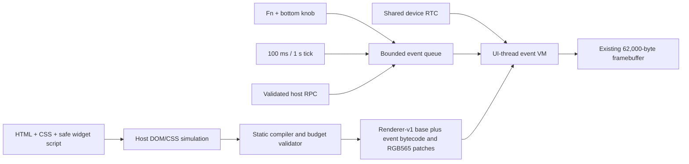

# Renderer v2: event-driven widgets

## Decision

Renderer v2 keeps renderer-v1 as the pixel and CSS-layout compiler, then adds a
small event runtime. HTML and CSS still resolve on the host. JavaScript may use
a documented DOM-like authoring surface, but the first device target is bounded
bytecode and precompiled RGB565 patches rather than a browser or `jsdom`.

`jsdom` is useful for host tests and DOM-state simulation. It is a Node-focused
implementation of web standards and does not perform visual CSS layout. It is
therefore neither a renderer nor an appropriate firmware dependency. Chromium
remains the source of truth for browser-raster scenes; renderer-v1 remains the
source of truth for the bytes shown by the keyboard.

The first prototype does not execute `jsdom` or user JavaScript at build time.
It statically parses a documented JavaScript/DOM-shaped subset, proves that its
initial state matches the renderer-v1 HTML/CSS pixels, and lowers the accepted
state transitions to the fixed F2EP event program. Unsupported JavaScript is a
compile error rather than a host-only behavior that could diverge from the
keyboard.



## What we know

- The logical canvas is 100x310 RGB565, exactly 62,000 bytes.
- Renderer-v1 already validates and renders semantic or raster scenes into one
  controller-owned framebuffer on a 100 ms LVGL-thread callback.
- Fn plus the bottom encoder reaches the active screen controller with encoder
  ID 1 and a signed delta.
- The stock Framer RTC can be read through its existing serialized device path.
  Renderer v2 treats a valid stock RTC sample as authoritative for ID26 instead
  of requiring a host to set the clock after every boot.
- The existing RPC design can parse bounded messages outside the LVGL task,
  publish state with memory barriers, and apply it on the UI callback.
- ID26 and ID27 share one 98,304-byte scene store and the existing 62,000-byte
  RGB565 framebuffer. ID27 has its own small event state, not a second scene
  store or full-screen pixel buffer.

## What renderer v2 can do without a JavaScript engine

- Maintain fixed signed integer state slots.
- Receive monotonic 100 ms and 1 second events.
- Consume a screen-local Fn+bottom-knob delta.
- Apply `state += event.delta * nonzeroInt32` with defined modulo-2^32
  two's-complement arithmetic.
- Consume a fixed-ID, bounded host RPC scalar.
- Run a capped, loop-free instruction stream.
- Select precompiled text, color, visibility, frame, or number variants.
- Apply sorted, non-overlapping RGB565 patch spans after renderer-v1 draws the
  base frame.
- Render a six-digit clock from ten digit glyph variants. It does not store
  86,400 complete clock frames.

This is enough for the first three examples: a knob-selected value, a local
clock advanced every second, and a host-published value.

## Deliberately unsupported in the deterministic target

- parsing HTML or CSS on the keyboard;
- selector searches or a live cascade/layout engine;
- creating, moving, or deleting arbitrary DOM nodes;
- `eval`, dynamic imports, network, filesystem, promises, or timers created by
  user code;
- unbounded loops, recursion, allocation, strings, or object graphs;
- direct LVGL access from an encoder or RPC callback;
- accepting engine bytecode based only on a SHA-256 integrity check.

The authoring compiler must reject code it cannot prove fits the state,
instruction, event, patch, and dirty-pixel budgets. It must not silently move
unsupported behavior to the device.

## Prototype ABI

Events are fixed 16-byte little-endian records:

| Offset | Field | Contract |
|---:|---|---|
| 0 | kind `u8` | 1=tick.100ms, 2=tick.1s, 3=Fn+bottom-knob, 4=host RPC |
| 1 | flags `u8` | bit 0 is Fn; all other bits zero |
| 2 | id `u16` | 0 for ticks, encoder ID 1, or fixed host event ID |
| 4 | value `i32` | tick increment, signed knob delta, or scalar RPC value |
| 8 | sequence `u32` | monotonic producer sequence |
| 12 | reserved `u32` | must be zero |

The queue has eight FIFO entries and is drained only by the UI callback.
Overflow is reported and drops the new event; it does not overwrite an older
event. A one-second event is synthesized every tenth 100 ms callback.

Instructions are fixed eight-byte records. The runtime has 16 signed 32-bit
state slots, at most 64 instructions per handler, and only constant load,
event load/add, immediate add, scaled event-delta add, positive modulo,
min/max clamp, and halt. Opcode 8 is the scaled form: it multiplies the signed
event delta by a nonzero signed 32-bit immediate, then adds it to the selected
state slot modulo 2^32. This is the defined two's-complement result; the C
implementation does not rely on signed-overflow behavior. There is no
allocation or backward branch.

Bindings select a precompiled RGB565 patch variant from a state slot using a
positive divisor and modulo. Initial bounds are 16 bindings, 512 total patch
spans (a fixed 4 KiB table), and 16 KiB of patch bytes. Spans are ordered, non-overlapping pixel
ranges within the existing framebuffer.

## Working implementation

The reusable SDK surface is exported as
`framer-f1-research-widget-sdk/renderer-v2` from
[`src/render-v2`](../src/render-v2). It contains:

- a fail-closed parser for the bounded `widget.on(...)`, `event.value`,
  `event.delta`, `mod`, `clamp`, `formatTime`, `pick`, `textContent`, and
  `style.color` authoring subset;
- the renderer-v1 HTML/CSS preparation and exact RGB565 dirty-patch linker;
- a self-contained canonical F2EP encoder;
- a host reference runtime with the same event admission rules as the firmware
  model; and
- types plus a package export for downstream SDK users.

[`examples/render-v2-events`](../examples/render-v2-events) is compiled
through `prepareRenderV2(widget.html, widget.css, widget.js) -> linkRenderV2 ->
F2EP`. Its handlers exercise clock ticks, Fn+bottom-knob, and the fixed
host-RPC path. The SDK model and native model are checked for bytecode and
pixel parity, bounded queue behavior, scaled-delta arithmetic, malformed-input
rejection, and last-good-frame recovery. The runtime borrows renderer-v1's
62,000-byte framebuffer and allocates no second framebuffer.

The focus-clock and focus-timer examples add pixel-exact raster-linker tests for
safe margins, four-digit boundaries, immediate positive and negative detents,
one-second countdown, generation-paired publication, and the shared scene-store
budget. Generated hashes remain build artifacts and test inputs; this document
does not substitute them for the current manifests.

Run the proof from `f1-widget-sdk`:

```sh
node examples/render-v2-events/build.mjs
node examples/render-v2-focus-dial/build.mjs
node examples/render-v2-focus-timer/build.mjs
node --test test/render-v2*.test.mjs
```

These commands are hardware-free. A device result is accepted separately and
must name the exact app, rollback, recovery data, and physical deployment
receipt.

## Clock, timer, and input details

ID26 samples the stock device RTC on its visible UI-thread cadence. A valid RTC
hour/minute/second tuple replaces the displayed time and is authoritative. A
monotonic one-second tick preserves forward progress from the last valid sample
if an RTC read is temporarily unavailable. Fixed event `0xB201` remains an
ID26 diagnostic input; normal clock operation does not require host time sync,
and the diagnostic does not write the shared RTC.

ID27 uses Fn plus the bottom encoder. Each signed detent immediately changes
the visible `MM:SS` value by five minutes and clamps the editable range; the
one-second event then counts toward zero. The active handler consumes only Fn +
encoder ID 1. An unmodified detent, another encoder, or unavailable input falls
through to normal firmware navigation.

Screen callbacks run only for the visible controller. Consequently the ID27
countdown intentionally pauses while another screen is visible and resumes
from its retained value when ID27 is shown again. It is not a hidden wall-clock
alarm. This behavior avoids a second background task and keeps LVGL and
framebuffer access on the visible UI callback.

## Full JavaScript option

[MicroQuickJS](https://github.com/bellard/mquickjs) is the strongest future
candidate. Its project reports operation with as little as 10 KiB RAM and
about 100 KiB ROM on ARM Thumb-2, a fixed caller-supplied heap, compacting GC,
and a strict ES5-like subset. It still supplies no DOM, layout, or renderer,
and this workspace has not proven an ESP32-S3/Xtensa integration.

[JerryScript](https://jerryscript.net/) is the fallback embedded engine; its
project targets under 64 KiB RAM and under 200 KiB ROM. Full
[QuickJS](https://bellard.org/quickjs/quickjs.html) has useful memory, stack,
and interrupt controls but is materially larger. None of these engines turns
HTML/CSS into pixels. Each would call the same tiny native event/UI facade used
by the deterministic runtime.

An offline cross-build removes one uncertainty. MQuickJS commit
`203d5bb79789bc47b74855d9207415dab71661a0` (2026-06-04) compiles with the
workspace's Xtensa ESP32-S3 GCC 13.2.0 as ELF32 little-endian Xtensa. The core
object is 73,292 bytes of text. Its complete upstream C-API example linked
against the toolchain's newlib/nosys support is 137,428 bytes of text, 280 bytes
of initialized data, and 376 bytes of BSS. This proves compiler/ISA
compatibility only. It does **not** prove ESP-IDF task integration, fixed-heap
placement, timing, interrupt behavior, or safety inside the patched stock
firmware.

Before enabling an engine on hardware, require all of the following:

1. Xtensa ESP32-S3 little-endian cross-build with no unresolved runtime ABI.
2. Fixed 32-64 KiB heap and repeatable OOM recovery.
3. A per-callback deadline (initial target 2 ms) and interrupt proof.
4. No LVGL calls outside the UI task.
5. Last-good-frame recovery after timeout, exception, or VM reset.
6. Steady-state internal/PSRAM telemetry with Music and WPM still active.
7. Authenticated source or compiler output. QuickJS-family bytecode is
   version-specific and is not a security boundary.

ESP-IDF's [external RAM guidance](https://docs.espressif.com/projects/esp-idf/en/latest/esp32s3/api-guides/external-ram.html)
also requires accounting for cache-disabled periods and cache pressure. Keep
the event ring, callback stack, and handoff words in internal RAM; pause the VM
during flash/NVS operations.

## Production direction

Ship the deterministic compiler target first. Treat MicroQuickJS as an
optional backend for scripts that genuinely need richer logic, while retaining
the same event schema, node/property allowlist, dirty-patch renderer, resource
limits, and recovery behavior. That makes a future JavaScript engine an
execution choice rather than a rewrite of the widget format.

## Native and device lane

The workspace now contains the bounded native F2EP decoder/validator/VM,
UI-thread queue drain and patch application, Fn+bottom-encoder
consume/fallback arbitration, status-only scene publication, ID26 RTC adapter,
and the separate ID27 controller. The combined layout preserves Music ID1 and
WPM Pet ID7 while registering clock ID26 and timer ID27.

One generation-paired upload contains the shared raster F1WB followed by the
ID26 and ID27 F2EP programs in the single 98,304-byte store. Publication is
RAM-only and boot-lifetime; it does not write user scenes to flash. The
app-only deployment workflow remains a separate, opt-in operation guarded by
an exact same-device rollback receipt and full-flash recovery set. Offline
build success is not physical acceptance: the matching deployment receipt and
manual ID1/ID7/ID26/ID27 screen checks remain the source of truth for a flashed
candidate.
